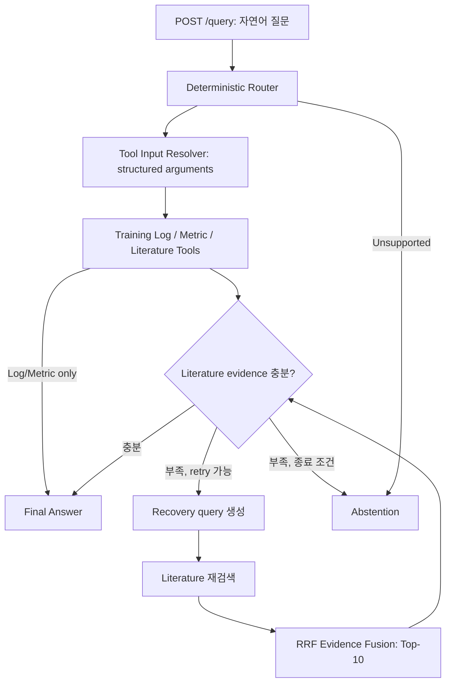

# Evidence-Grounded Agentic RAG

운동 기록을 PostgreSQL에서 조회·계산하고, 연구 문헌을 Hybrid Retrieval로 검색하여 근거와 함께 답변하는 Agentic RAG 프로젝트입니다. 근거가 부족하면 제한된 추가 검색을 수행하고, 끝까지 충분하지 않으면 답변을 보류합니다.

**현재 상태:** FastAPI REST API와 Swagger 구현, 자연어 Tool Input Resolver 연결, 실제 Literature / Log-Metric / Hybrid API smoke test 완료.

Python · PostgreSQL/pgvector · Dense + BM25 + RRF · LangGraph · Pydantic · FastAPI

## 실행 구조



- **Router:** Tool 종류와 순서를 규칙 기반으로 결정합니다. LLM Planner 비교 결과는 [실험 이력](docs/HISTORY.md)에 정리했습니다.
- **Tool Input Resolver:** 선택된 structured Tool의 인자만 추출합니다. 명시적인 운동명·N·날짜는 deterministic parsing, 복잡한 표현은 typed LLM fallback을 사용합니다.
- **Training Log / Metric:** 기록 조회와 Epley e1RM, first/last N-session median, weekly volume/frequency, training gap 등을 분리합니다.
- **Literature:** frozen corpus 22편·488 chunks, Dense + BM25(k1=1.2, b=0.75) + RRF(k=60), Top-10을 사용합니다.
- **Runtime Grader / Recovery:** required component의 근거를 확인하고 최대 2회 재검색합니다. Fusion 이후에도 evidence budget은 10개입니다.
- **Answer:** structured 기록과 문헌 근거를 구분하고 사용한 Tool 결과와 chunk ID를 추적합니다.

## 프로젝트 이력

- 초기에는 frozen 30 cases로 Retrieval v1(Dense / BM25 / Hybrid), Router vs LLM Planner, Grader v1/v2/v2.1, E2E v1/v2 실험을 수행했습니다. 같은 평가셋을 반복 사용한 integration 비교이며 독립적인 일반화 성능이 아닙니다.
- 후속 실패 원인 분석에서 Retrieval 설계 문제가 발견됐습니다. 예를 들어 문헌 청크의 94.67%가 임베딩 모델 입력 한도(128토큰)를 넘어 잘리고, 점수가 0인 BM25 결과도 RRF 순위에 기여합니다.
- 과거 실험 소스는 Git tag `legacy-pre-retrieval-v2`에 보존했습니다. 결과 요약은 [실험 이력](docs/HISTORY.md)과 [평가 요약](docs/EVALUATION.md)에 있습니다.
- 현재 브랜치에서는 Retrieval v2를 변수 하나씩 독립적으로 비교하는 방식으로 재설계합니다.

최근 실제 REST smoke test에서는 같은 개발용 질문 3개가 모두 HTTP 200 / answer_ready로 완료됐습니다. Log/Metric과 Hybrid의 Resolver는 deterministic 방식으로 작동했습니다. 이는 연결 검증이며 성능 평가 결과에 합산하지 않았습니다.

## 설치와 API 확인

로컬 실험은 Windows, Python, PostgreSQL 18 / pgvector 환경에서 수행했습니다.

```powershell
python -m venv .venv
.\.venv\Scripts\Activate.ps1
python -m pip install -r requirements-api.txt
python -m uvicorn src.api.app:app --host 127.0.0.1 --port 8000
```

- Swagger UI: <http://127.0.0.1:8000/docs>
- ReDoc: <http://127.0.0.1:8000/redoc>
- `GET /health`: 서버 liveness
- `GET /version`: 공개 가능한 runtime 설정
- `POST /query`: `{"question": "내 Deadlift (Barbell)의 처음 3-session과 최근 3-session median e1RM을 비교해줘."}`

`/health`, `/version`, 문서 확인은 DB/API 연결을 요구하지 않습니다. 실제 `/query` 실행에는 PostgreSQL 데이터, frozen corpus/embedding artifacts와 서버 프로세스의 `PGPASSWORD`, `OPENAI_API_KEY`가 필요합니다. [.env.example](.env.example)은 빈 설정 안내이며 자동 로드되지 않습니다. 비밀값은 코드·명령행 인자·Git에 넣지 않습니다.

응답은 `final_status`, `answer_text`, `route`, `tools_used`, `retry_count`, `recovery_used`, `used_literature_chunk_ids`, `limitations`, `latency_ms`를 포함합니다. 정상적인 graph 종료인 answer_ready / abstain_ready / execution_failure는 HTTP 200 structured response로 반환합니다.

로컬 API는 `내 데드리프트의 처음 3세션과 최근 3세션의 median e1RM을 비교해줘`처럼 한글 운동명과 세션 표현도 처리합니다. 지원 표현과 범위는 [한국어 입력 안내](docs/KOREAN_INPUT.md)를 참고하세요. 기존 동결 Router와 평가 산출물을 보존하고 API 구성에 실행용 어댑터를 연결한 변경입니다. 서버를 재시작해야 적용됩니다.

선택적으로 `AGENTIC_RAG_QUESTION_INTERPRETATION=phase_a`를 설정하면 규칙 우선 + LLM fallback 질문 해석을 사용합니다. 실제 DB 운동 후보 선택과 typed 검증 후 기존 single-metric workflow에 연결하며, 불명확한 조건은 Tool 실행 전에 확인합니다. 설정하지 않으면 legacy 경로를 사용합니다. [Phase A 실행 안내와 한계](docs/QUESTION_INTERPRETATION.md)를 참고하세요. 이 변경은 기존 frozen 평가 이후의 runtime 개선으로, 과거 평가 성능이 개선됐다는 의미가 아닙니다.

**이 공개 저장소는 코드와 검토된 문서 배포본입니다.** 원본 데이터와 frozen 실행 산출물은 포함하지 않으므로 clone만으로 전체 `/query`나 과거 평가를 재현할 수 없습니다. 자료 준비 및 DB 적재 절차는 [db/README.md](db/README.md), 공개 범위는 [PUBLISHING.md](docs/PUBLISHING.md)에 정리했습니다. 인증·rate limiting·다중 사용자 데이터 격리가 없는 로컬 데모이므로 현재 실행 예시는 loopback 주소를 사용합니다.

## 테스트

공개 소스만으로 실행 가능한 API contract 테스트:

```powershell
python -m pytest tests/test_api_health.py tests/test_api_query.py tests/test_api_smoke_v2_harness.py -q
```

로컬 연구 자료가 있는 환경에서는 `python -m pytest -q`로 전체 suite를 실행합니다. 과거 실험 코드를 tag로 분리한 뒤 전체 검증은 **435 passed**입니다. 전체 suite 중 frozen integrity·corpus·평가 및 실제 운동 후보 테스트는 비공개 로컬 artifacts에 의존하며, 이를 숨기기 위해 테스트를 skip하거나 계약을 바꾸지 않았습니다.

## 코드 구성

```text
src/api/             FastAPI endpoints and runtime dependencies
src/graph/           LangGraph orchestration and Tool Input Resolver
src/interpretation/  Rule-first question interpretation and exercise validation
src/tools/           Training Log, Metric, Literature contracts
src/retrieval/       Dense, BM25, RRF and pgvector retrieval
src/grading/         Runtime Evidence Grader and Grader evaluation metric
src/recovery/        Recovery query generation and evidence fusion
src/answer/          Grounded answer and abstention
src/evaluation/      Evaluation-set contracts and retrieval/routing/E2E metrics
src/agent/           Typed tool-plan contracts and executor
src/routing/         Deterministic Router
src/preprocessing/   Training-log normalization and eligibility
src/literature/      Literature ingestion and provenance
db/                  PostgreSQL schemas and pgvector setup
config/              Non-secret configuration and prompts
scripts/             Setup, evaluation-set and smoke entrypoints
tests/               Runtime, evaluation and data-preparation tests
docs/                Repository map, history, evaluation and publishing notes
```

파일별 역할(실행 / 평가 / 데이터 준비)은 [저장소 구성 지도](docs/REPOSITORY_MAP.md)를 참고하세요. 과거 실험 전용 코드는 현재 브랜치에 없으며 `legacy-pre-retrieval-v2` tag에서 확인할 수 있습니다. frozen v1/v2 산출물은 로컬에서 그대로 보존합니다.

## 운동 후보 확인 (Phase A.2)

Phase A 실행 모드에서 여러 저장 운동 후보가 남으면 선택을 요청하고 Tool 실행을 보류합니다.
`POST /query/clarify`에 반환된 확인 ID와 option ID를 보내면 해석을 반복하지 않고 실행을 재개합니다.
명시적 공동 조회만 허용하며 로컬 메모리 state는 20분 후 만료됩니다.
사용 방법과 제한은 [운동 후보 선택 문서](docs/EXERCISE_CLARIFICATION.md)를 참고하세요.
